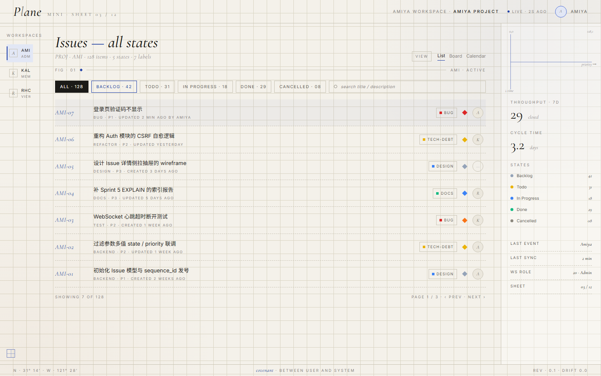
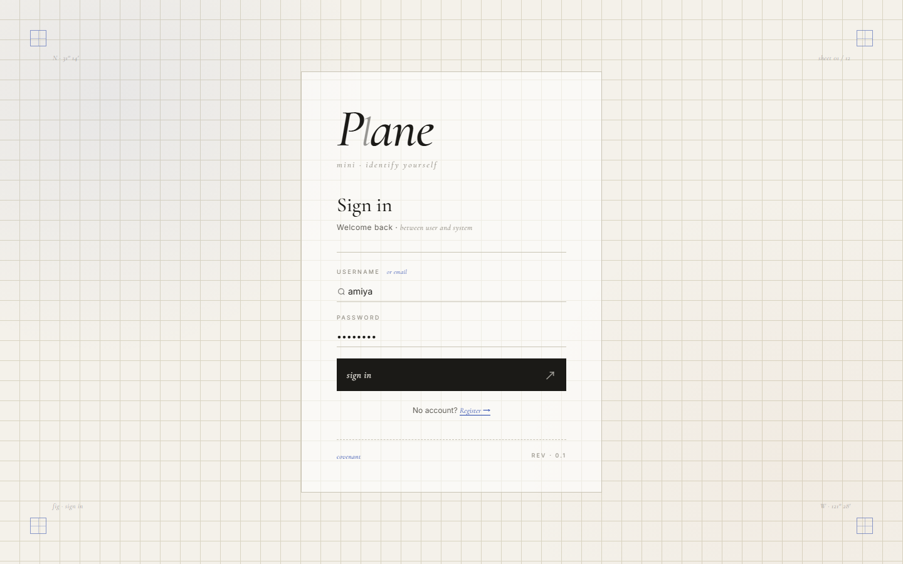
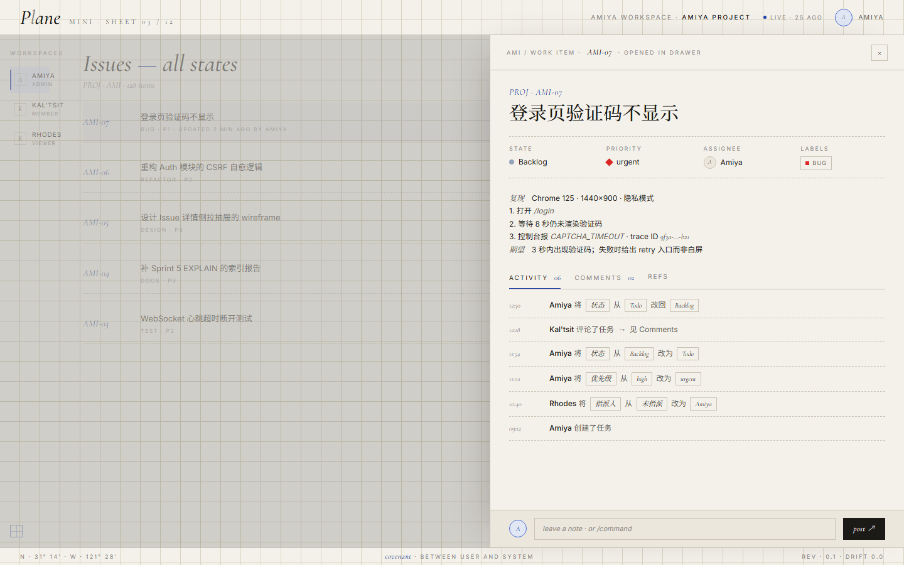

# Mini Plane

仿 [Plane](https://github.com/makeplane/plane) 的迷你项目管理软件（双人学习项目）：从 0 实现用户、工作区、项目、任务（Issue）管理的完整业务链路，最终目标是具备阅读并贡献真实 Plane 源码的能力。

<p align="center">
  
</p>

## 当前进度

| 模块 | 状态 | 进度 | 对应 Sprint |
|------|------|------|------------|
| 后端 MVP（含 Auth / WS / Realtime / Cache） | ✅ 完成 | ▓▓▓▓▓▓▓▓▓▓ | [Sprint 0–8](docs/devlog/) |
| 后端 CI + Docker + Release v0.1.0 | ✅ 完成 | ▓▓▓▓▓▓▓▓▓▓ | Sprint 8 |
| 前端设计语言 + 屏幕蓝图 | ✅ 完成 | ▓▓▓▓▓▓▓▓▓▓ | [DESIGN.md](frontend/DESIGN.md) |
| 前端 Sprint 0：脚手架 + 设计系统 | ✅ 完成 | ▓▓▓▓▓▓▓▓▓▓ | [Sprint 0 devlog](frontend/docs/devlog/sprint-0-frontend.md) |
| 前端 Sprint 1：Auth 闭环 | 🟡 下一步 | ░░░░░░░░░░ | [FRONTEND_ROADMAP §2](frontend/FRONTEND_ROADMAP.md) |
| 前端 Sprint 2：Workspace + Project | ⏳ 计划 | ░░░░░░░░░░ | — |
| 前端 Sprint 3：Issue 核心 | ⏳ 计划 | ░░░░░░░░░░ | — |
| 前端 Sprint 4–8：Comments / Realtime / Docker | ⏳ 计划 | ░░░░░░░░░░ | — |

> 实时进度详见 [docs/devlog/README.md](docs/devlog/README.md)（后端）+ [frontend/docs/devlog/](frontend/docs/devlog/)（前端）。

## 设计语言：Blueprint Editorial

<p align="center">
  
  &nbsp;&nbsp;
  
  &nbsp;&nbsp;
  
</p>

整套 UI 走 **Blueprint Editorial（蓝图编辑风）**：暖灰白底 `#F4F1EA` + 钴蓝细线高亮 `#1F3FA8` + 古典衬线 Cormorant Garamond italic 做装饰 + Inter 做正文 + 0.5px 直角边框 + 32px 网格底纹 + 坐标轴 / 十字标记 / 装饰词。完整规格见 [frontend/DESIGN.md](frontend/DESIGN.md)。

> **反 AI 模板**：不引入组件库（shadcn/MUI 都拒）、不引入图标库（14 个图标全部自绘 SVG）、不做暗色模式（CSS variables 已抽象，二期可加）、不使用渐变 / 阴影 / 毛玻璃 / emoji。

## 文档导航

| 你想知道 | 看这里 |
|---------|--------|
| 项目目标与协作原则 | [plane_mini_collaboration_plan.md](plane_mini_collaboration_plan.md) |
| 后端执行计划 | [BACKEND_PLAN.md](BACKEND_PLAN.md) |
| 前端执行计划 | [frontend/FRONTEND_ROADMAP.md](frontend/FRONTEND_ROADMAP.md) |
| 设计系统 | [frontend/DESIGN.md](frontend/DESIGN.md) |
| 屏幕蓝图 | [frontend/SCREEN_BLUEPRINTS.md](frontend/SCREEN_BLUEPRINTS.md) |
| 设计决策日志 | [frontend/DESIGN_DECISIONS.md](frontend/DESIGN_DECISIONS.md) |
| 架构总览（请求/推送/任务三条链路） | [ARCHITECTURE.md](ARCHITECTURE.md) |
| 接口契约（前后端唯一事实源） | [docs/API.md](docs/API.md) 与 [docs/api/](docs/api/) |
| 前端接入手册（含 CSRF 自愈 / 错误分流 / WS 重连） | [docs/api/09-frontend-integration.md](docs/api/09-frontend-integration.md) |
| 后端开发日志 | [docs/devlog/](docs/devlog/) |
| 前端开发日志 | [frontend/docs/devlog/](frontend/docs/devlog/) |

## 技术栈

| 端 | 技术 |
|------|------|
| Backend | Python 3.12 · Django 5.2 LTS · Django REST Framework · PostgreSQL 16 |
| 异步与实时 | Redis · Celery · WebSocket（Channels / daphne） |
| 工程化 | Docker Compose · GitHub Actions CI · ruff · drf-spectacular |
| Frontend | Next.js 16 (App Router) · React 19 · TypeScript strict · Tailwind CSS v4 |
| Frontend 状态 | Zustand (UI 状态) · TanStack Query (服务端状态) · react-hook-form + zod |
| Frontend 字体 | Cormorant Garamond (装饰) · Inter (正文) · JetBrains Mono (等宽) — `@fontsource` 自托管 |

## 目录结构

```text
mini-plane/
├── backend/                          # Django + DRF + Channels + Celery（已完成 MVP）
├── frontend/                         # Next.js（开发中）
│   ├── DESIGN.md · SCREEN_BLUEPRINTS.md · FRONTEND_ROADMAP.md · DESIGN_DECISIONS.md
│   ├── app/                          # App Router
│   ├── components/{ui,shell,icons,providers}
│   ├── features/                     # 业务特性（Sprint 1+ 填充）
│   ├── lib/api.ts                    # 统一 fetch（CSRF 自愈 / 错误分流）
│   ├── stores/                       # Zustand stores
│   ├── docs/devlog/                  # 每个 Sprint 一份
│   └── docs/assets/                  # 设计稿与真实 build 截图
├── docs/
│   ├── API.md · api/                 # 接口契约（手维护 + openapi.yaml 校验）
│   └── devlog/                       # 后端 Sprint 日志
├── docker-compose.yml                # web / db / redis / worker / asgi
├── BACKEND_PLAN.md · ARCHITECTURE.md
└── plane_mini_collaboration_plan.md  # 双人协作总计划
```

## 快速开始

### 后端（任选其一）

#### A. Docker 一键起全套（推荐）

```bash
docker compose up --build -d
```

| 入口 | 地址 |
|------|------|
| 健康检查 | <http://127.0.0.1:8000/api/v1/health/> |
| Swagger | <http://127.0.0.1:8000/api/docs/> |
| WebSocket | `ws://127.0.0.1:8001/ws/...`（分开的端口） |

#### B. 本地开发

```bash
cd backend
python -m venv .venv && .venv/Scripts/activate
pip install -r requirements/local.txt
cp .env.example .env  # 填入 SECRET_KEY / DATABASE_URL
python manage.py migrate
python manage.py runserver  # daphne 接管，HTTP + WS 同端口 8000
```

### 前端

```bash
cd frontend
pnpm install
cp .env.example .env.local
pnpm dev  # 默认 http://localhost:3000
```

环境变量 `NEXT_PUBLIC_API_BASE` 默认 `http://127.0.0.1:8000`，`NEXT_PUBLIC_WS_BASE` 默认 `ws://127.0.0.1:8000`。

> **首次接入建议**：先跑后端，再启前端，打开 <http://localhost:3000> 应看到 Blueprint Editorial 风格的占位首页（[preview-sprint0-home.png](frontend/docs/assets/preview-sprint0-home.png)），证明字体 / 网格 / 组件全部加载成功。

## 运行测试

后端：

```bash
cd backend
python manage.py test --settings=config.settings.test --noinput
ruff check . && ruff format --check .
```

前端（Sprint 8 后启用，目前脚手架阶段尚未配置）：

```bash
cd frontend
pnpm typecheck
pnpm build
```

## 协作约定

- 分支：`feat/backend-<模块>-<简述>` / `feat/frontend-<模块>-<简述>`，不直接推 main
- Commit：`<type>(backend|frontend): <简述>`
- PR 按模板（What / Why / How / Testing / Breaking Changes）
- main 受 branch protection：CI 全绿 + 双向 Review 通过才可合并
- API 先冻结契约（[docs/api/](docs/api/)）再开发；契约变更走 PR；改接口必须重生成 `openapi.yaml`（CI 校验一致性）
- 每个 Sprint 收尾写一份 devlog（后端放 [docs/devlog/](docs/devlog/)，前端放 [frontend/docs/devlog/](frontend/docs/devlog/)），记录做了什么 / 怎么做的 / 踩坑 / 下一步
- AI 是工具不是作者：每个 Sprint 的 DoD 里有一条"能脱离 AI 讲清楚每段代码为什么存在"