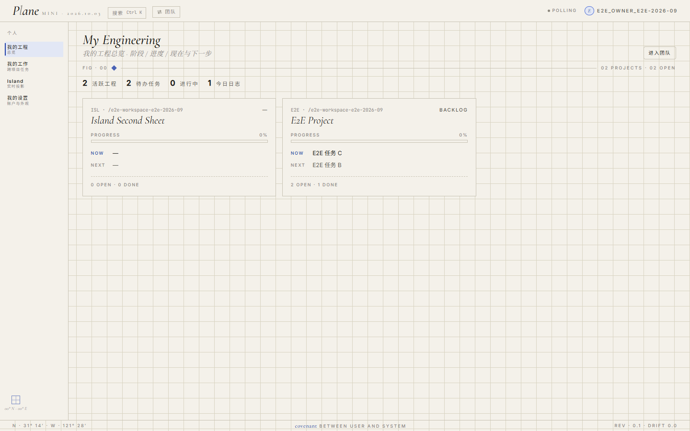
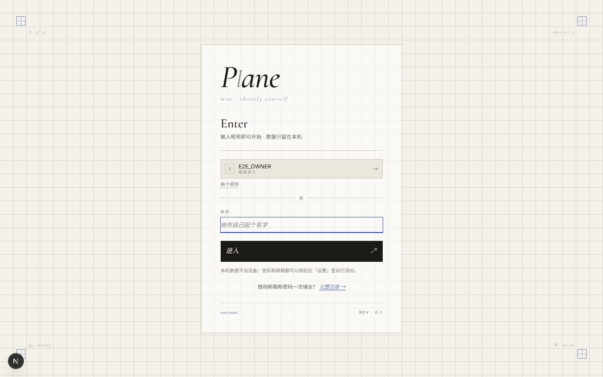
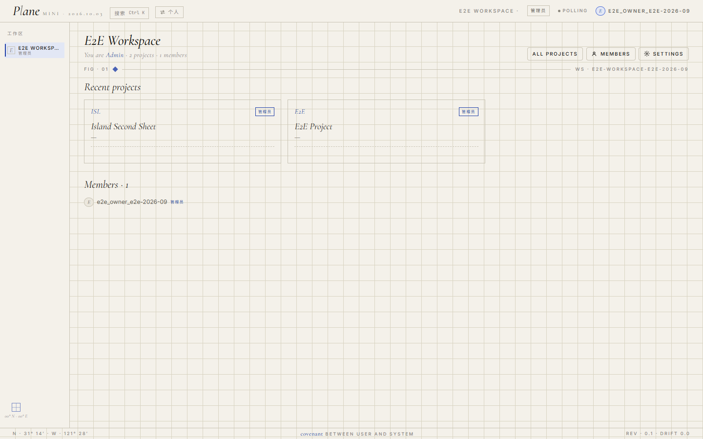

# Mini Plane

> **本地运行的个人工程管理系统。** 前端、后端、数据库都在你自己的机器上，数据不出本机。
> 双击一个图标就是一个原生窗口应用，不装 PostgreSQL，不联网也能用（除 AI Agent 功能外）。

<p align="center">
  
</p>

<p align="center">
  <sub>真实产品截图 · 真实数据（由 <code>scripts/capture-screenshots.mjs</code> 用真实登录态自动采集）</sub>
</p>

<p align="center">
  <b>Python 3.12</b> · <b>Django 5.2 LTS</b> · <b>Next.js 16</b> · <b>React 19</b> · <b>TypeScript</b> · <b>Tailwind v4</b> · <b>Channels/WebSocket</b> · <b>pywebview</b><br>
  <b>后端 334</b> 用例 · <b>前端 129</b> 单测 · <b>33</b> 条浏览器 E2E · <b>CI 双 job</b>
</p>

---

## 目录

- [1. 这是什么](#1-这是什么)
- [2. 界面导览（逐屏）](#2-界面导览逐屏)
- [3. 功能清单](#3-功能清单)
- [4. 给 AI Agent 的接入](#4-给-ai-agent-的接入)
- [5. 快速开始](#5-快速开始)
- [6. 架构](#6-架构)
- [7. 测试与质量](#7-测试与质量)
- [8. 设计语言](#8-设计语言)
- [9. 路线图](#9-路线图)
- [10. 文档索引](#10-文档索引)

---

## 1. 这是什么

它最初是「仿 [Plane](https://github.com/makeplane/plane) 的迷你项目管理软件」。做到一半改了主意：

> **大多数人不是来「排期」的，是来「记住我今天把工程推到哪儿了」的。**

于是产品重构成两层——**但没有推倒重来**，底层（认证 / 权限 / 任务 / 评论 / 动态 / 实时 / 桌面 / 测试）全部复用，只把「产品中心」从**任务**移到**工程**：

```text
                         Mini Plane
                              │
              ┌───────────────┴───────────────┐
              │                               │
         MY ENGINEERING                 WORKSPACE
              │                               │
     我的工程总览 / Island                    │
              │                          工作区 · 成员 · 角色
             Plan                             │
              │                            Project
            Stages                            │
              │                             Task
             Task                        Comment · Activity
              │                          Realtime
           Worklog
              │
        Agent Sync
```

三层产品信条（贯穿全部代码与文档）：

| # | 信条 | 含义 |
|---|------|------|
| 1 | **Task 是计划，Worklog 是证据** | 任务写"打算做"，工程日志写"实际做了什么、结论如何"。这是与 Todoist / Linear 一类产品最本质的区别 |
| 2 | **百分比是辅助，阶段与 NOW 才是主信息** | 所以 Island 上最显眼的是「当前阶段 / NOW / NEXT / TODAY」，百分比只占一行 |
| 3 | **Markdown 是原始事实，Mini Plane 是结构化索引** | AI 写的 devlog 不会被数据库取代；系统负责把散落的 Markdown 汇总成"今天这个工程进行到哪了" |

**形态**：本地运行的单机软件。服务只绑 `127.0.0.1`、DEBUG 关闭、SECRET_KEY 首跑随机生成并存本机、桌面版用内嵌 SQLite（无需安装数据库）。

---

## 2. 界面导览（逐屏）

界面为中文，衬线大标题按设计语言保留英文。

### 2.1 进入 —— 记住"上次是谁"

<p align="center">
  
</p>

**昵称优先的免密入口**：输入昵称即可开始（本地单机版不该在第一次打开时逼你注册），密码与邮箱可在设置里自助绑定。

若本机已有账户，登录页会**直接显示该账户的用户名与头像，点一下就进**：

| 情况 | 行为 |
|------|------|
| 免密账户（默认） | 直接进入 |
| 设过密码 | 落到密码步，昵称已填好，只需输密码 |
| 账户已被删除 | 清掉记忆并提示换昵称 |

会话 cookie 跨启动保留，所以**重开应用免登录**。

### 2.2 我的工程（首页 `/`）

<p align="center">
  
</p>

跨项目聚合视图，不再以"工作区列表"开头：顶部是**今日工程状态条**（活跃工程 / 待办任务 / 进行中 / 今日日志数），下面是每个项目一张卡片——进度条、**NOW**（当前在做的事）、**NEXT**（队列里下一件）、开关数、是否有 Agent 在跑。

`/projects/mine/` 由**一条 SQL 聚合**返回（correlated subquery + Coalesce + Exists），无 N+1。

### 2.3 顶栏的 ⇄ 按钮 —— 个人 ⇄ 团队

顶栏（logo 与搜索之间）一个按钮切换两层：

- 在**个人层**点它 → 去**你上次停留的那个工作区**（没有记录则去工作区列表）
- 在**团队层**点它 → 回「我的工程」

切换时 URL 跟着变（链接可分享），左侧竖栏按层换内容但**宽度不变**（主区域零抖动）。"上次在哪"记在 localStorage 的 `mp-last-team-path`。

### 2.4 Engineering Island —— 当前工程状态的实时投影

**一张图纸 = 一个项目**；**左右滑动 = 翻工程图纸**（不是切任务）。这是整个项目里最独特的一块。

```text
┌──────────────────────────────────────────────┐
│ AMI · SHEET 03 / 08                  ● LIVE  │   ← 页眉：图号 + 修订标记
│                                              │
│ TTS Stability                        72%     │   ← 阶段 + 进度
│ ███████████████░░░░                         │
│                                              │
│ NOW                                          │
│ 验证 216–260 字长文本                         │   ← 当前在做的事
│                                              │
│ TODAY                                        │
│ ✓ 参考音频重新训练                            │   ← 今天的工程日志
│ ✓ 推理参数调整                                │
│                                              │
│ NEXT                                         │
│ 整理实验结果                                  │   ← 队列里下一件
│                                              │
│ AGENT · RUNNING 02:14                        │   ← Agent 会话与计时
├──────────────────────────────────────────────┤
│ FIG · 03 / 08              ── MY ENGINEERING │   ← 页脚：图号 + 标注线
└──────────────────────────────────────────────┘
```

| 能力 | 说明 |
|------|------|
| 两种形态 | **Focus**（完整图纸页）/ **Resting**（44px 单行，尽量不打扰） |
| 翻页 | 左右滑动 · 键盘 `←/→` · 到边缘**停住**（不循环——环回会让人以为"还有更多"） |
| 实时 | 只对**当前图纸**订阅 WebSocket：Agent 起会话 → 事务内广播 `agent.session` → 图纸上的 AGENT 行立刻变 RUNNING |
| 视觉 | 双线框 · 8px 图纸网格 · 四角十字准星 · 裁切标记 · FIG / SHEET / REV 标注；动效 200ms 且只动 `transform`/`opacity` |
| 位置记忆 | 当前图纸记在 URL（`?sheet=<项目id>`），刷新、分享、前进后退都回到同一张 |

### 2.5 桌面版：主窗口 + Island 悬浮窗

桌面 App（pywebview + WebView2）会开**两个窗口**：

- **主窗口**：完整应用
- **Island 窗口**：置顶 · 无边框可拖 · 顶部居中 · **默认隐藏**，`Alt+I` 或界面上的「独立窗口」按钮唤出

两个窗口共享当前图纸（localStorage 同步，零延迟、不绕后端），关掉 Island 窗口不影响主窗口。

### 2.6 项目 · Global Plan / Stage

项目页分三段：**GLOBAL PLAN**（阶段路线，带权重与进度）→ **当前状态**（当前阶段 / 进度 / NOW / TODAY / NEXT）→ **TASKS** 与 **ENGINEERING LOG**。

- 进度不是单一百分比：`Σ(阶段权重 × 阶段进度) / Σ权重`
- Stage 有 `weight` / `progress` / `is_current`（同一计划内仅一个当前阶段）
- 新建项目自动预置五状态：`Backlog → Todo → In Progress → Done → Cancelled`

### 2.7 任务列表 —— 筛选即 URL

<p align="center">
  
</p>

支持状态 / 优先级 / 指派人 / 标签多选、标题搜索、按时间 / 编号 / 优先级排序、分页。**所有筛选都写进 URL**——复制链接给同事，对方看到完全相同的视图；非法参数被静默丢弃而不是报错。

### 2.8 任务抽屉 —— 动态审计 + 评论对话

<p align="center">
  
  &nbsp;&nbsp;
  
</p>

同一个抽屉里两个列表**顺序相反是故意的**：动态（Activity）**倒序**——审计要看"最新发生了什么"；评论（Comments）**正序**——评论是对话。

- 四个字段**就地编辑**（状态 / 优先级 / 指派人 / 标签），乐观更新、失败自动回滚
- 动态记录"谁在何时把什么改成了什么"（含可显示的旧值/新值，不是 UUID）
- 评论可编辑自己的；**作者优先于角色**——管理员也不改别人的评论
- 改动会**产生活动留痕**，因此前端写操作会同时失效活动缓存

### 2.9 批量操作

<p align="center">
  
</p>

勾选多行 → 底部浮出操作条：改状态 / 优先级 / 指派（逐条下发，**部分失败如实汇报**并支持「重试失败项」）、改标签（覆盖式，走异步任务）、删除（二次确认）。

### 2.10 团队层（工作区 · 成员 · 角色）

<p align="center">
  
</p>

团队能力完整保留，只是从"产品中心"降级为"协作基础设施"：工作区列表、成员管理、三级角色（管理员 / 成员 / 只读）、工作区设置、项目与任务、评论、动态、实时协作。

<p align="center">
  <sub>共 14 条路由 · <code>(protected)</code> 个人层 4 条 · <code>(protected)/w/[slug]</code> 团队层 6 条 · <code>(panel)</code> 桌面 Island 1 条</sub>
</p>

---

## 3. 功能清单

| 模块 | 能力 | 状态 |
|------|------|------|
| **认证** | 昵称优先免密登录 · 记住上次账户一键进入 · 密码/邮箱自助绑定 · 会话持久化 | ✅ |
| **个人工程** | 跨项目总览（单条 SQL 聚合）· NOW / NEXT / 今日日志 / Agent 运行态 | ✅ |
| **项目** | 标识符 · 预置五状态 · 懒创建 | ✅ |
| **Global Plan / Stage** | 阶段路线 · 权重 · 加权进度 · 当前/下一阶段 | ✅ |
| **任务** | 状态 / 优先级 / 指派人 / 标签 · 就地编辑 · 搜索 · 6 种排序 · 分页 | ✅ |
| **工程日志** | date/标题/摘要/详情/结论/下一步/阻塞 · 关联阶段 · 来源标记 | ✅ |
| **评论** | 对话流 · 编辑自己的 · 作者优先于角色 | ✅ |
| **动态审计** | 谁在何时改了什么 · 倒序时间线 | ✅ |
| **批量操作** | 改状态/优先级/指派/标签 · 异步任务 · 部分失败重试 | ✅ |
| **实时协作** | WebSocket 广播（issue.updated / comment.created / agent.session）· 断线退避重连 | ✅ |
| **Engineering Island** | 图纸页 · Resting/Focus · 左右翻页 · 进度/阶段/NOW/TODAY/NEXT/AGENT · 图纸视觉 | ✅ |
| **桌面 Island 窗口** | 置顶 · 可拖 · 顶部居中 · 隐藏启动 · 跨窗口同步 | ✅ |
| **Agent Local API** | Token（只显示一次明文）· scope 白名单 · 幂等键 · Session 与实时投影 | ✅ |
| **个人 ⇄ 团队切换** | 顶栏 ⇄ 按钮 · URL 即状态 · 记住上次团队位置 | ✅ |
| **桌面 App** | pywebview 原生窗口 · 内嵌 SQLite · 会话持久化 · 关窗停服 · PyInstaller 单文件 exe | ✅ |
| **工程化** | GitHub Actions 双 job · 契约 00–09 + OpenAPI 快照 · ruff 全目录 · Playwright E2E | ✅ |
| Markdown → Worklog 自动导入 | 解析 `docs/devlog/*.md` 写入 Worklog | ⏳ 二期 |
| Blocker 独立实体 | 目前是 Worklog 的字段，尚未升为一级概念 | ⏳ 待定 |
| MCP 包装层 | 等 REST API 稳定后再做 | ⏳ 二期 |

---

## 4. 给 AI Agent 的接入

**不要求 Agent 去开浏览器点按钮**——那条路太脆弱。Agent 直接调本地 REST API：

```text
AI Agent ──Bearer mpa_…──▶ Local REST API ──▶ Django ──▶ DB
                                        └── 事务内广播 ──▶ WebSocket ──▶ 界面 / Island
```

| 能力 | 端点（`/api/v1/agent/`） |
|------|---------------------------|
| 建 Token（用户会话，明文只返回一次） | `POST tokens/` → `{ "token": "mpa_…" }` |
| 读项目 / 推进任务 | `POST tasks/` · `tasks/<id>/start/` · `tasks/<id>/complete/` |
| 写工程日志 | `POST worklogs/` |
| 更新阶段进度 | `POST projects/<slug>/<id>/progress/` |
| 起 / 结束会话 | `POST sessions/` · `sessions/<id>/end/` |

**三条设计约束**（都是为了安全与可重放）：

1. **权限独立**：Agent Token 与用户 Session 是两套认证；scope 只有 5 项（读项目 / 读任务 / 写任务 / 写日志 / 更新阶段进度）——**没有删除、没有成员管理、没有角色变更，也不能改 Global Plan 的结构**。Token 泄漏时损害范围有限。
2. **幂等**：所有写操作接受 `Idempotency-Key`，重复请求（例如 Agent 重试）不会产生重复数据。
3. **实时投影**：会话状态在事务内广播 `agent.session`，界面与 Island 立刻变 `AGENT · RUNNING`，不需要刷新。

**这条链路有端到端测试兜底**（`tests/e2e/agent-island-loop.spec.ts`）：建 Token → 换身份起会话 → **Island 不刷新就变成 RUNNING**。因为 `/projects/mine/` 没有轮询，这条用例只有 WebSocket 真把事件推到界面才会通过。

---

## 5. 快速开始

> ⚠️ **host 一致性铁律**：页面与 API 必须同 host，端口可不同。开发模式统一 `localhost`（页面 3000 / API 8000），桌面版统一 `127.0.0.1`（已内置）。混用会导致会话 Cookie 与 CSRF 全部失效。

### 方式一：桌面 App（推荐给"只想用起来"）

```bat
python scripts\package.py                                   :: 构建单机产物
backend\.venv\Scripts\python.exe desktop\build.py           :: 打包 dist\MiniPlane\MiniPlane.exe
```

双击即用：原生窗口、内嵌 SQLite（**不用装 PostgreSQL**）、首跑自动建库、会话持久化、关窗干净停服。
`Alt+I` 唤出置顶的 Island 悬浮窗。**改过前端源码后必须重跑这两条命令**，否则桌面版仍是旧界面。

### 方式二：开发模式

```bat
scripts\dev.cmd          :: 起后端+前端，等就绪，自动开浏览器
scripts\dev.cmd e2e      :: 起栈 → 跑 Playwright 33 用例 → 报结果
scripts\dev.cmd status   :: 两个端口各是什么状态
scripts\dev.cmd down     :: 全部停掉
```

手工：后端 `python manage.py migrate && python manage.py runserver`（daphne 接管 8000，HTTP 与 WS 同端口）；前端 `pnpm install && pnpm dev`（3000）。

### 方式三：Docker Compose

```bash
docker compose up --build -d
```

健康检查 <http://127.0.0.1:8000/api/v1/health/> · Swagger <http://127.0.0.1:8000/api/docs/> · WS `ws://127.0.0.1:8001/ws/...`

---

## 6. 架构

```text
        ┌──────────── 浏览器 / 桌面 WebView2 ────────────┐
        │              Next.js 16 (App Router)            │
        │  TanStack Query ─ 服务端状态   Zustand ─ 客户端 │
        └───────┬───────────────────────────┬────────────┘
                │ ① HTTP 读写                │ ③ WebSocket 推送
                ▼                            ▼
     ┌────────────────────┐      ┌───────────────────────────┐
     │ Django REST (DRF)  │      │ Channels + daphne         │
     │ 权限唯一判定点      │      │ 只广播三类工程事件：        │
     │ core/permissions   │      │ issue.updated             │
     └─────────┬──────────┘      │ comment.created           │
               │                 │ agent.session             │
               ▼                 └───────────────────────────┘
     ┌────────────────────┐
     │ ② Celery 异步任务  │  默认 eager 同步执行，不强制起 worker
     └─────────┬──────────┘
               ▼
     ┌────────────────────┐
     │ PostgreSQL 16      │  桌面单机版用内嵌 SQLite
     └────────────────────┘
```

后端应用：`users` · `workspaces` · `projects`(+plan/stage) · `issues` · `activity` · `worklogs` · `agents`(token/idempotency/session) · `realtime` · `jobs`，外加 `core`（权限判定、序列化、缓存、测试基类）。

**四条贯穿全局的架构约束**：

1. **轻量**：聚合查询单条 SQL 杜绝 N+1 · 默认不启 Redis / Celery worker（eager 同步）· HTTP 与 WS 同端口 · 前端产物 `standalone`（Docker 镜像 22MB）
2. **实时只广播工程事件**：刻意收窄为三类，不做全站广播
3. **URL 是唯一事实来源**：筛选、抽屉、标签页、当前图纸、模式切换全在 URL
4. **契约先行**：接口契约 `docs/api/00–09` 是前后端唯一事实源，改接口必须重生成 `openapi.yaml`（CI 校验一致性）

```text
mini-plane/
├── backend/
│   ├── apps/            users · workspaces · projects(+plan,stage) · issues · activity
│   │                    worklogs · agents(token,idempotency,session) · realtime · jobs
│   ├── config/          settings(local/test/desktop/container) · asgi · urls
│   ├── requirements/    base / local / test / prod / desktop
│   └── scripts/         smoke_backend.py（54 步）· smoke_realtime.py（25 步）
├── frontend/
│   ├── app/             (protected) 个人层 · (auth) · (panel) 桌面 Island
│   ├── components/      ui · shell · icons(自绘) · auth · engineering-island
│   ├── features/        auth · workspace · project · issue · comment · activity
│   │                    worklog · agent · realtime · engineering-island
│   ├── lib/ stores/ types/
│   ├── tests/           unit（129，零依赖）· e2e（33，Playwright）
│   ├── DESIGN.md · SCREEN_BLUEPRINTS.md · FRONTEND_ROADMAP.md
│   └── docs/devlog/     前端各 Sprint 日志
├── desktop/             launcher.py · island.py · window_manager.py · build.py
├── scripts/             dev.cmd / dev.ps1 · package.py
├── docs/                PRODUCT_REFACTOR_PLAN.md · HANDOVER.md · 使用指南.md
│                        api/（契约 + openapi.yaml）· devlog/ · releases/
├── runtime/             本机运行态（SQLite / SECRET_KEY / WebView2 profile）——不进仓库
└── dist/                打包产物——不进仓库
```

---

## 7. 测试与质量

| 类别 | 数量 | 命令 |
|------|------|------|
| 后端 | **334** | `cd backend && .venv\Scripts\python.exe manage.py test --noinput --settings=config.settings.test` |
| 前端单测 | **129** | `cd frontend && pnpm test`（`node --test`，零依赖） |
| 浏览器 E2E | **33** | `scripts\dev.cmd e2e`（Playwright + 真实 Chrome） |

CI（`.github/workflows/ci.yml`，两个 job 全绿才可合并）：

- **backend**：`ruff check` / `ruff format --check`（覆盖 `backend/`、`desktop/`、`scripts/`）→ `makemigrations --check` → `spectacular --validate --fail-on-warn` → 与 `docs/api/openapi.yaml` 快照 diff → 全量测试 → Redis 缓存后端实测
- **frontend**：`pnpm install --frozen-lockfile` → `lint` → `typecheck` → `test` → `build` → 断言 standalone 产物存在

> 设计原则：**先跑最便宜最能拦的**（lint / 类型 / 迁移漂移 / schema diff），最后才跑慢的（测试 / build）。
> 单测刻意只覆盖"算错了但界面看着还挺正常"的地方（进度量纲、翻页边界、计时进位、脏数据、URL 形态）。

---

## 8. 设计语言

**Blueprint Editorial（蓝图编辑风）**：工程图纸的视觉语言，用在个人工程管理上。

- 纸底 `#F4F1EA` · 墨 `#1B1A17` · 钴蓝细线 `#1F3FA8` · 尺线 `#C8C3B4`
- 0.5px 直角边框 · 32px 蓝图网格 · 十字准星 · 裁切标记 · FIG / SHEET / REV 标注
- 字体：西文 Cormorant Garamond（装饰衬线）/ Inter（正文）/ JetBrains Mono（等宽），中文思源宋体 / 思源黑体（`@fontsource` 自托管，OFL）
- 明暗主题 + 显示大小可调，首屏无闪白

**红线**（`frontend/DESIGN.md`）：不引组件库 · 不引图标库（图标全部自绘 SVG）· 不用渐变 / 毛玻璃 / 大圆角 / 多层阴影 / emoji · 字重不超过 500 · **动效只允许 `transform`/`opacity` 且 150–250ms** · 不用 loading spinner（一律骨架屏）。

规格：[`frontend/DESIGN.md`](frontend/DESIGN.md) · [`frontend/SCREEN_BLUEPRINTS.md`](frontend/SCREEN_BLUEPRINTS.md) · [`frontend/DESIGN_DECISIONS.md`](frontend/DESIGN_DECISIONS.md)

---

## 9. 路线图

```text
v0.3.0 Personal Engineering Foundation   ✅ Sprint 09
v0.4.0 Project Plan & Stage              ✅ Sprint 10
v0.5.0 Engineering Worklog               ✅ Sprint 11
v0.6.0 Agent Local API                   ✅ Sprint 12
v0.7.0 Agent Session & Realtime Sync     ✅ Sprint 13
v0.8.0 Engineering Island MVP            ✅ Sprint 14
v0.9.0 Engineering Island Desktop        ✅ Sprint 15
      Island Polish                       ✅ Sprint 16
v1.0.0 Personal ⇄ Collaboration         ✅ Sprint 17
      ── 待办：发版（tag + Release）
      ── 可选：组件测试（Vitest）· Lighthouse 90 · Markdown → Worklog 导入
         Blocker 独立实体 · MCP 包装层 · 任务截止日期与逾期
```

**非目标**（防止再次失控）：不删工作区 · 不删团队权限 · 不重写任务系统 · 不重写实时层 · 不重写桌面启动器 · 不立即做 MCP · 不做复杂 AI 自动规划 · 不做多人实时编辑。

---

## 10. 文档索引

| 你想知道 | 看这里 |
|---------|--------|
| **产品到底要做什么**（唯一事实源） | [`docs/PRODUCT_REFACTOR_PLAN.md`](docs/PRODUCT_REFACTOR_PLAN.md) |
| **接手本项目 / 当前进度 / 踩坑** | [`docs/HANDOVER.md`](docs/HANDOVER.md) |
| **v1.0.0 目标达成审计**（计划逐条对照） | [`docs/v1.0.0-goal-audit.md`](docs/v1.0.0-goal-audit.md) |
| 分角色使用说明 | [`docs/使用指南.md`](docs/使用指南.md) |
| 接口契约（前后端唯一事实源） | [`docs/API.md`](docs/API.md) 与 [`docs/api/`](docs/api/) |
| 前端接入手册（CSRF 自愈 / WS 重连 / 常见坑） | [`docs/api/09-frontend-integration.md`](docs/api/09-frontend-integration.md) |
| 后端 / 前端执行计划 | [`BACKEND_PLAN.md`](BACKEND_PLAN.md) · [`frontend/FRONTEND_ROADMAP.md`](frontend/FRONTEND_ROADMAP.md) |
| 各 Sprint 开发日志 | [`docs/devlog/`](docs/devlog/) · [`frontend/docs/devlog/`](frontend/docs/devlog/) |
| 发布说明 | [`docs/releases/`](docs/releases/) |

---

## 协作约定

- 分支 `feat/<模块>-<简述>`，不直接推 main；提交 `<type>(<域>): <简述>`
- **接口先冻结契约再开发**；改接口必须重生成 `docs/api/openapi.yaml`（CI 校验一致性）
- 每个 Sprint 收尾写 devlog：做了什么 / 怎么做 / 踩了什么坑 / 下一步；并更新本 README 的状态
- 每次推送后**核对远端 CI**，爆红自行修完再推，不留红灯
- 改了前端记得**重建桌面版产物**（`scripts\package.py` + `desktop\build.py`）
- **AI 是工具不是作者**：任何一段代码都应能讲清「为什么这样写、不那样写」

> 这个项目也是学习产物：每一天的取舍与踩坑都留在 `docs/devlog/` 里，
> 包括**做错的地方**（例如曾违反自己的动效红线、曾让桌面版产物停滞 10 天）。
