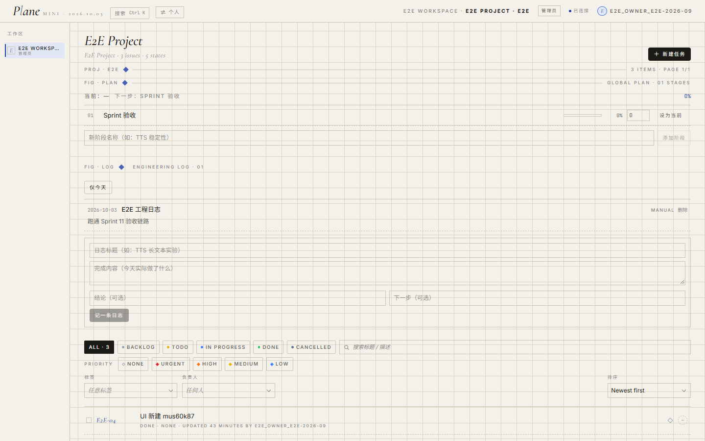
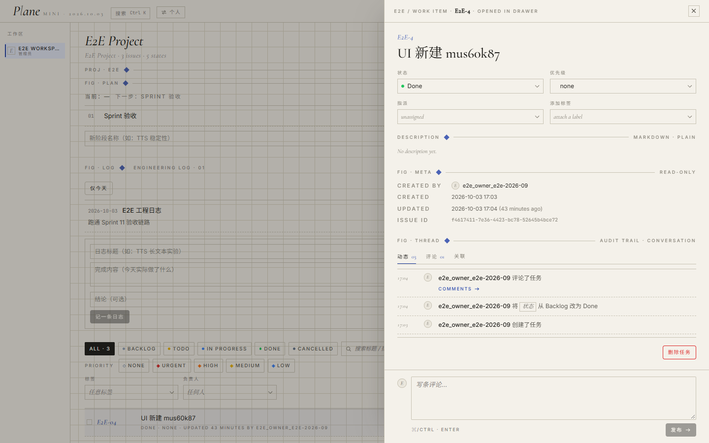
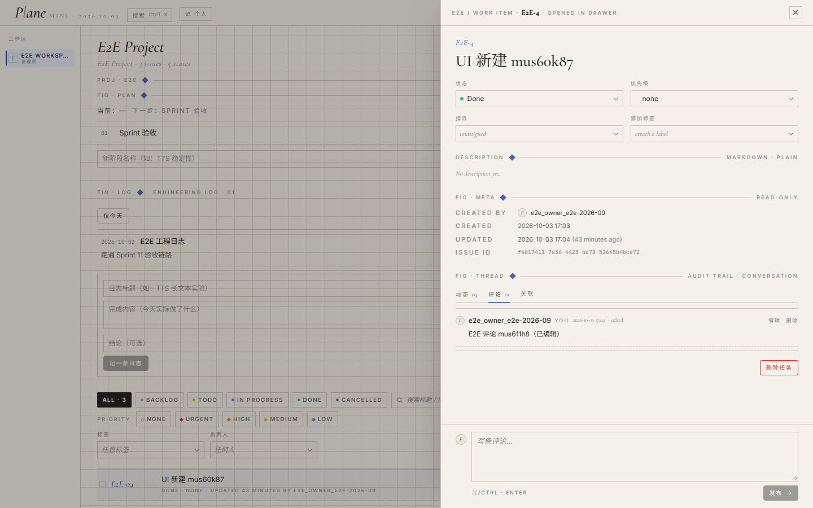
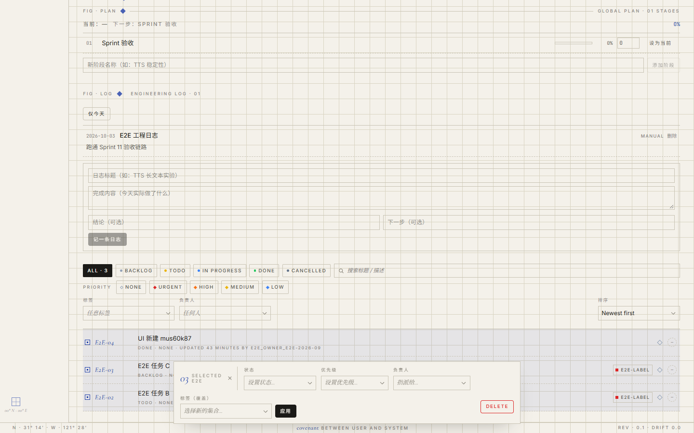

# Mini Plane

> **本地运行的个人工程管理系统。** 数据、数据库、界面全在你自己的机器上，不出本机。
> 双击一个图标就有原生窗口，断网也能用（除 AI Agent 功能外）。

<p align="center">
  
</p>

<p align="center"><sub>真实产品截图 · 生产构建 + 真实数据 —— 不是设计稿</sub></p>

---

## 一分钟看懂

它最早是「仿 [Plane](https://github.com/makeplane/plane) 的迷你项目管理软件」，做到一半改了主意：
**大多数人不是来「排期」的，是来「记住我今天把工程推到哪儿了」的。** 于是产品重构成两层：

| 层 | 是什么 | 入口 |
|----|--------|------|
| **Personal Engineering**（默认） | 我的工程：项目 / 计划 / 阶段 / 任务 / **工程日志** / **Agent** | `/`（首页即工程总览） |
| **Collaboration** | 工作区与团队权限，保留但不喧宾夺主 | `/workspaces` |

三个一句话概念（贯穿全项目的信条）：

```text
Task 是计划，Worklog 是证据。     ← 百分比是辅助，阶段与当前任务（NOW）才是主信息
Worklog ≠ Task。                  ← 任务说"要做什么"，日志说"实际做了什么、结论如何"
Island 是投影，不是通知。          ← 当前工程状态的一张图纸，随时瞄一眼
```

<p align="center">
  
  &nbsp;&nbsp;
  
  &nbsp;&nbsp;
  
</p>

---

## 目录

- [一分钟看懂](#一分钟看懂) · [使用指南](#使用指南) · [快速开始](#快速开始)
- [测试与质量](#测试与质量) · [架构三链路](#架构三链路) · [设计语言](#设计语言)
- [技术栈](#技术栈) · [目录结构](#目录结构) · [文档导航](#文档导航) · [路线图](#路线图)

---

## 使用指南

> 界面中文为主；工作区 / Recent projects / Members 等衬线大标题按设计语言保留英文。
> 完整分角色说明见 [`docs/使用指南.md`](docs/使用指南.md)。

### 1. 账户（本地单机版：昵称优先）

首屏只填**昵称**即可进入，密码与邮箱可在 `/me → 安全` 自行绑定——本机软件不该在第一次打开时逼你注册。
重开窗口免登录（会话持久化）。

### 2. 工程总览（`/`）

首页跨项目聚合：每个项目一张卡片，显示进度条、开着的任务数、**今日工程日志数**、最近动态，
以及是否有 Agent 正在跑。

### 3. Engineering Island（`/island`）★ v0.8.0 新增

**当前工程状态的实时投影**：一张图纸 = 一个项目。

- **左右滑动 = 翻工程图纸**（不是切任务）；键盘 `←/→` 同样可翻；到边缘**停住**（不循环——环回会让人以为"还有更多"）
- 图纸页信息：**Project / 当前阶段 / 进度 / NOW / TODAY / NEXT / AGENT**
  - `NOW` 当前在做的事 · `NEXT` 队列里下一件 · `TODAY` 今天的工程日志清单 · `AGENT` Agent 会话状态与计时
- **收起为最小态**（44px 单行）：不打扰工作，需要时点开
- 当前图纸记在 URL（`?sheet=<项目 id>`）：刷新、分享链接、前进后退都回到同一张
- 数据来自 `GET /api/v1/projects/mine/`（单条 SQL 聚合，无 N+1）；只在**当前图纸**上订阅 WebSocket

### 4. 项目（Project）与计划（Plan / Stage）

- 新建项目填名称 + 标识符（如 `AMI`，出现在每个任务编号前：`AMI-1`）
- 自动预置五状态：`Backlog → Todo → In Progress → Done → Cancelled`
- **Global Plan**：项目可挂一串 Stage（阶段）带权重，进度 = `Σ(权重×进度)/Σ权重`
  —— 阶段是主信息，百分比只是它的投影

### 5. 任务（Task / Issue）

列表支持状态 / 优先级 / 指派人 / 标签多选、标题搜索、排序（时间 / 编号 / 优先级）、分页；
**所有筛选都写进 URL**，复制链接给同事，对方看到完全相同的视图。

点开抽屉：**就地编辑**四个字段（乐观更新，失败自动回滚）、只读描述、
**动态（Activity）**审计时间线（谁在何时把什么改成了什么，倒序）、**评论**（正序，可编辑自己的）。

> 同一个抽屉里两个列表顺序相反是**故意的**：审计看"最新发生了什么"（倒序），评论是"对话"（正序）。

### 6. 工程日志（Worklog）

记录 date / 标题 / 摘要 / 详情 / 结论 / 下一步 / 阻塞，可关联阶段，来源可标记 `manual / agent / imported`。
它与任务最大的区别：**任务写"打算做"，日志写"做完了什么、结论如何"**。

### 7. 批量操作

勾选多行 → 底部浮出操作条：改状态 / 优先级 / 指派（逐条下发，**部分失败如实汇报并支持「重试失败项」**）、
改标签（覆盖式，走异步任务）、删除（二次确认）。

### 8. 实时协作

右上角 `● live` 表示 WebSocket 已连通。别人改了状态或发了评论，你这边自动更新；
断网指数退避重连，会话过期跳登录，无权限的项目停止重连（不无限重试）。

### 9. Agent Local API（v0.6.0+）

给 AI 编程助手用的本地接口：`/me → Agent` 建 **Token**（明文只显示一次，服务端只存哈希）、
按 scope 白名单授权，所有写操作支持 `Idempotency-Key` 幂等。
Agent 可起 **Session**，并把 `agent.session` 事件实时推给界面（Island 与首页角标都会亮）。

---

## 快速开始

> **host 一致性铁律**：页面与 API 必须同 host，端口可不同。
> 开发模式统一 `localhost`（页面 3000 / API 8000）；桌面版统一 `127.0.0.1`（已内置）。
> 混用会导致会话 Cookie / CSRF 全部失效——这是本项目踩过的最贵的坑。

### 方式一：桌面 App（推荐给「只想用起来」）

双击桌面「Mini Plane」图标：原生窗口、内嵌 SQLite（**不用装 PostgreSQL**）、首跑自动建库、
会话持久化、关窗即干净停服。

换新机从零构建（需 Python 3.12+ / Node 20+ / WebView2，Win11 自带）：

```bat
cd backend && python -m venv .venv
.venv\Scripts\python -m pip install -r requirements\local.txt -r requirements\desktop.txt
cd .. && python scripts\package.py                                  :: 构建单机产物到 dist\
backend\.venv\Scripts\python.exe desktop\build.py                  :: 打包 dist\MiniPlane\MiniPlane.exe
powershell -NoProfile -ExecutionPolicy Bypass -File desktop\make_shortcut.ps1 -Exe "%CD%\dist\MiniPlane\MiniPlane.exe"
```

### 方式二：开发模式（改代码用这个）

```bat
scripts\dev.cmd          :: 起后端+前端，等就绪，自动开浏览器
scripts\dev.cmd e2e      :: 起栈 → 跑 Playwright 27 用例 → 报结果
scripts\dev.cmd status   :: 两个端口各是什么状态
scripts\dev.cmd down     :: 全部停掉
```

手工也行：后端 `python manage.py migrate && python manage.py runserver`（daphne 接管 8000）；
前端 `pnpm install && pnpm dev`（3000）。

### 方式三：Docker Compose（后端全家桶）

```bash
docker compose up --build -d
```

健康检查 `http://127.0.0.1:8000/api/v1/health/` · Swagger `http://127.0.0.1:8000/api/docs/` ·
WS `ws://127.0.0.1:8001/ws/...`。`NEXT_PUBLIC_*` 是**构建期**常量，改后端地址要重新 build。

---

## 测试与质量

| 类别 | 数量 | 命令 |
|------|------|------|
| 后端 | **334** | `cd backend && .venv/Scripts/python.exe manage.py test --noinput --settings=config.settings.test` |
| 前端单测 | **111** | `cd frontend && pnpm test`（node --test，零依赖） |
| 浏览器 E2E | **27** | `scripts\dev.cmd e2e`（Playwright + 真实 Chrome） |

CI（`.github/workflows/ci.yml`，两个 job 全绿才可合并）：

- **backend**：装依赖 → `ruff check` → `ruff format --check` → `makemigrations --check`
  → `spectacular --validate --fail-on-warn` → 与 `docs/api/openapi.yaml` 快照 diff → 全量测试 → `check_cache`
- **frontend**：`pnpm install --frozen-lockfile` → `lint` → `typecheck` → `test` → `build` → 断言 standalone 产物存在

> 设计原则：**先跑最便宜最能拦的**（lint / 类型 / 迁移漂移 / schema diff），最后才跑慢的（测试 / build）。

---

## 架构三链路

```text
        ┌──────────── 浏览器 / 桌面 WebView2 ────────────┐
        │              Next.js 16 (App Router)            │
        │  TanStack Query ─ 服务端状态   Zustand ─ 客户端 │
        └───────┬───────────────────────────┬────────────┘
                │ ① HTTP 读写                │ ③ WebSocket 推送
                ▼                            ▼
     ┌────────────────────┐      ┌───────────────────────────┐
     │ Django REST (DRF)  │      │ Channels + daphne         │
     │ 权限唯一判定点      │      │ 只广播三类工程事件：       │
     │ core/permissions   │      │ issue.updated             │
     └─────────┬──────────┘      │ comment.created           │
               │                 │ agent.session             │
               ▼                 └───────────────────────────┘
     ┌────────────────────┐
     │ ② Celery 异步任务  │  默认 eager 同步执行，不强制起 worker
     └─────────┬──────────┘
               ▼
     ┌────────────────────┐
     │ PostgreSQL 16      │  桌面单机版用内嵌 SQLite
     └────────────────────┘
```

关键约束（`PRODUCT_REFACTOR_PLAN` §8，继续开发请保持）：
聚合查询单条 SQL 杜绝 N+1 · 默认不启 Redis / worker · HTTP 与 WS 同端口 · 广播事件刻意收窄为工程状态三类。

---

## 设计语言：Blueprint Editorial

工程图纸风：暖灰白底 `#F4F1EA` + 钴蓝细线 `#1F3FA8` + 0.5px 直角边框 + 32px 网格底纹 +
坐标 / 十字准星 / FIG·SHEET 标注。字体：西文 Cormorant Garamond（装饰）、Inter（正文）、
JetBrains Mono（等宽），中文思源宋体 / 思源黑体（`@fontsource` 自托管，OFL）。

红线：❌ 渐变 / 模糊 / 毛玻璃 · 大圆角 · 多层阴影 · Emoji · 字体权重 600+ · 多套主题色 ·
动效只用 `transform`/`opacity` 且 150–250ms · 组件库与图标库（图标全部自绘 SVG）。

完整规格：[`frontend/DESIGN.md`](frontend/DESIGN.md) · [`frontend/SCREEN_BLUEPRINTS.md`](frontend/SCREEN_BLUEPRINTS.md)

---

## 技术栈

| 端 | 技术 |
|------|------|
| Backend | Python 3.12 · Django 5.2 LTS · DRF · Channels + daphne · Celery（eager）· PostgreSQL 16 / SQLite |
| 桌面 | pywebview（WebView2 原生窗口）· PyInstaller（单文件 exe） |
| Frontend | Next.js 16 (App Router, standalone) · React 19 · TypeScript strict · Tailwind v4 |
| Frontend 状态 | TanStack Query（服务端）· Zustand（客户端）· react-hook-form + zod |
| 工程化 | GitHub Actions（双 job）· ruff · drf-spectacular · Playwright · `scripts/package.py` |

---

## 目录结构

```text
mini-plane/
├── backend/
│   ├── apps/            users / workspaces / projects(+plan,stage) / issues / activity
│   │                    worklogs / agents(token,idempotency,session) / realtime / jobs
│   ├── config/          settings(local/test/prod/desktop/container) · asgi · urls
│   ├── requirements/    base / local / test / prod / desktop
│   └── scripts/         smoke_backend.py（54 步）· smoke_realtime.py（25 步）
├── frontend/
│   ├── app/ components/ features/ stores/ lib/ types/
│   ├── features/engineering-island/      ← Island 纯逻辑（可单测）
│   ├── tests/unit/（111）  tests/e2e/（27）
│   ├── DESIGN.md · SCREEN_BLUEPRINTS.md · FRONTEND_ROADMAP.md
│   └── docs/devlog/                     各 Sprint 日志
├── desktop/              launcher.py · build.py · make_shortcut.ps1
├── scripts/              dev.cmd / dev.ps1（一键起停）· package.py（组装单机包）
├── docs/
│   ├── PRODUCT_REFACTOR_PLAN.md   ★ 产品唯一事实源
│   ├── HANDOVER.md                交接文档
│   ├── 使用指南.md                 分角色使用说明
│   ├── api/                       契约 00–09 + openapi.yaml 快照
│   └── devlog/                    后端各 Sprint 日志
├── runtime/                       本机运行态（不进仓库）
└── dist/                          打包产物（不进仓库）
```

---

## 文档导航

| 你想知道 | 看这里 |
|---------|--------|
| **产品到底要做什么**（唯一事实源） | [`docs/PRODUCT_REFACTOR_PLAN.md`](docs/PRODUCT_REFACTOR_PLAN.md) |
| **接手本项目 / 当前进度 / 踩坑** | [`docs/HANDOVER.md`](docs/HANDOVER.md) |
| 分角色使用说明 | [`docs/使用指南.md`](docs/使用指南.md) |
| 后端 / 前端执行计划 | [`BACKEND_PLAN.md`](BACKEND_PLAN.md) · [`frontend/FRONTEND_ROADMAP.md`](frontend/FRONTEND_ROADMAP.md) |
| 接口契约（前后端唯一事实源） | [`docs/API.md`](docs/API.md) 与 [`docs/api/`](docs/api/) |
| 前端接入手册（CSRF 自愈 / WS 重连 / 常见坑） | [`docs/api/09-frontend-integration.md`](docs/api/09-frontend-integration.md) |
| 各 Sprint 开发日志 | [`docs/devlog/`](docs/devlog/) · [`frontend/docs/devlog/`](frontend/docs/devlog/) |

---

## 路线图

```text
v0.3.0 Personal Engineering Foundation   ✅ Sprint 09
v0.4.0 Project Plan & Stage              ✅ Sprint 10
v0.5.0 Engineering Worklog               ✅ Sprint 11
v0.6.0 Agent Local API                   ✅ Sprint 12
v0.7.0 Agent Session & Realtime Sync     ✅ Sprint 13
v0.8.0 Engineering Island MVP            ✅ Sprint 14（本轮）
v0.9.0 Engineering Island Desktop        ✅ Sprint 15：Island 变独立桌面窗口（置顶/拖拽/隐藏 + WS 同步）
      Island Polish                       ✅ Sprint 16：Paper Sheet / Blueprint Grid / Crosshair / FIG·REV
v1.0.0 Personal Engineering Platform     ⏳ Sprint 17：个人 ⇄ 团队模式可切换
```

**非目标**（防止再次失控）：不删工作区 · 不重写任务系统 · 不重写实时层 · 不立即做 MCP ·
不做复杂 AI 自动规划 · 不做多人实时编辑。

---

## 协作约定

- 分支 `feat/<模块>-<简述>`，不直接推 main；提交 `<type>(<域>): <简述>`
- **接口先冻结契约再开发**；改接口必须重生成 `docs/api/openapi.yaml`（CI 校验一致性）
- 每个 Sprint 收尾写 devlog：做了什么 / 怎么做 / 踩了什么坑 / 下一步
- 每个阶段推送后**核对远端 CI**，爆红自行修完再推，不留红灯
- 全局代码与安全检查：动了哪一边就跑哪一边的门禁（后端有 ruff 五道，前端有四绿）
- **AI 是工具不是作者**：任何一段代码都应能讲清「为什么这样写、不那样写」
